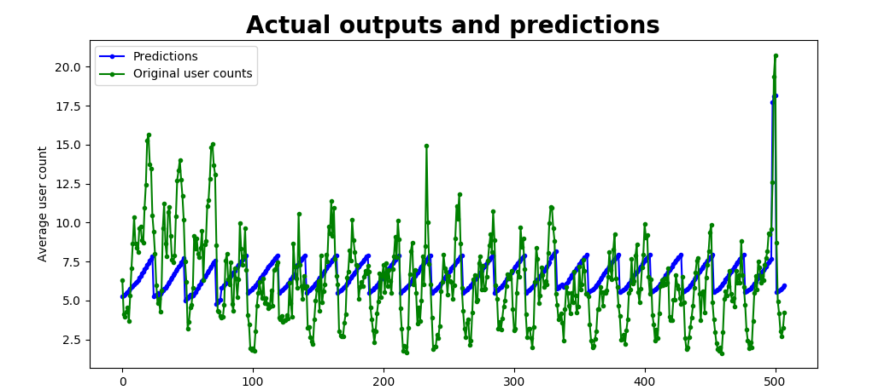
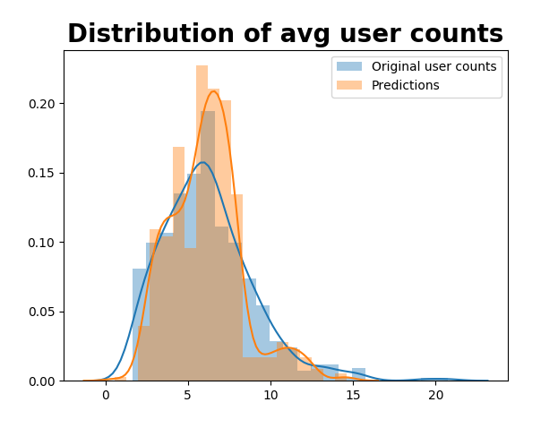

# Testing neural network 

In terms of artificial neural networks, an epoch refers to one cycle through the full training dataset. Here are some result, with 5 epochs and 300 epochs. 

### Just after 5 training rounds 

### After 300 training rounds

